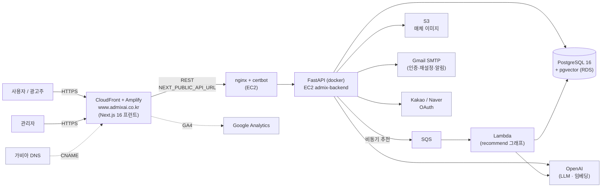
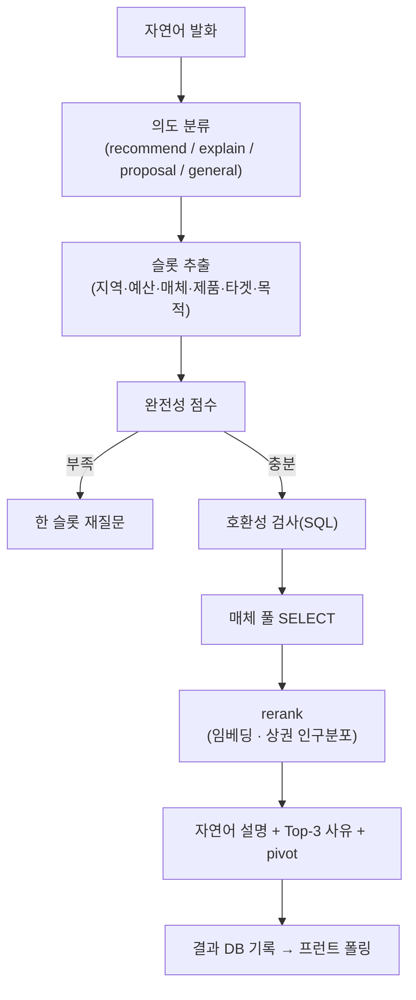

# admix

OOH(옥외광고) 매체 추천 플랫폼. 광고주 자연어 발화를 LangGraph 그래프로 분석해 매체 리스트·자연어 설명·맞춤 제안서를 만들고, 관리자 백오피스에서 매체·회원·문의·제안서를 운영한다.

상세 문서: **[backend/README](backend/README.md)** · **[frontend/README](frontend/README.md)** · [deploy/](deploy/README.md) · [CONTEXT.md](CONTEXT.md)

## 아키텍처

### 시스템 · 배포 구성



### 추천 요청 흐름



추천(`recommend_react`)은 비동기 잡 큐로 처리 — `POST /recommend/react/jobs` 발행 → SQS→Lambda가 그래프 실행 후 DB(`ai_recommend_jobs`)에 기록 → 프런트가 폴링. 로컬(SQS 미설정)은 동일 로직을 인라인 동기 실행. 그래프 상태는 langgraph-checkpoint-postgres로 thread별 영속. (자세히는 [backend/README](backend/README.md#추천-흐름-recommend_react))

## 스택

- **Backend**: FastAPI + LangGraph + PostgreSQL/pgvector + OpenAI, JWT/OAuth 소셜 로그인, AWS SQS/Lambda 비동기 추천
- **Frontend**: Next.js 16 + React 19 + Tailwind 4 (cosmos 디자인 토큰) + shadcn/ui + react-query
- **DB**: pgvector pg16, Alembic 마이그레이션
- **Infra**: EC2 + docker compose + nginx, Lambda(비동기 AI 추천), RDS(운영)

## 구조

```
admix/
├── backend/
│   ├── src/
│   │   ├── main.py                FastAPI app + CORS + lifespan
│   │   ├── config.py              Settings (DATABASE_URL, OPENAI_API_KEY 등)
│   │   ├── database.py            SQLAlchemy engine + Base
│   │   ├── models/                ORM 모델 (세션/회원/매체/제안서/문의 등)
│   │   ├── schemas/               Pydantic in/out
│   │   ├── routers/               API 엔드포인트
│   │   │   ├── auth.py oauth.py            인증 · 소셜 로그인
│   │   │   ├── chat_graph.py recommend_*   추천 챗봇 (현행 recommend_react · 비동기 잡 + 폴링)
│   │   │   ├── media.py members.py         매체 · 회원
│   │   │   ├── proposals*.py inquiries*.py 제안서 · 문의 (client/admin)
│   │   │   ├── faq.py dashboard.py         FAQ · 대시보드
│   │   │   └── admin*.py                   관리자 백오피스
│   │   ├── services/              비즈니스 로직
│   │   │   ├── graph/             LangGraph 노드/라우팅/빌더
│   │   │   ├── recommend_react/   React 기반 추천 파이프라인
│   │   │   ├── ai_job_service.py  SQS/Lambda 비동기 추천 잡
│   │   │   ├── deck_converter.py ppt_builder.py  제안서 PPT 생성
│   │   │   └── *_service.py       auth/media/member/proposal/inquiry/faq/dashboard/ga4
│   │   └── utils/
│   ├── alembic/                   DB 마이그레이션
│   ├── lambda_handler.py          AWS Lambda 진입점 (비동기 추천)
│   ├── Dockerfile · Dockerfile.lambda
│   └── requirements.txt · requirements-lambda.txt
│
├── frontend/
│   └── app/
│       ├── (client)/              사용자 화면 (추천 챗봇 · 매체 검색/지도 · 제안서 · 마이페이지)
│       ├── admin/                 관리자 백오피스
│       └── deck/                  제안서 뷰어
│
├── deploy/                        EC2 셋업 · nginx · 재배포/DB복원 스크립트
└── docker-compose*.yml            local / prod / newacct
```

## 셋업 (로컬)

```bash
# 1) 백엔드 env
cp backend/.env.example backend/.env   # OPENAI_API_KEY 등 입력

# 2) postgres + pgvector
docker compose up -d postgres
docker exec admix-postgres psql -U postgres -d admix -c "CREATE EXTENSION IF NOT EXISTS vector;"

# 3) DB 마이그레이션
cd backend && alembic upgrade head && cd ..

# 4) 전체 기동
docker compose up -d

# 5) 프런트 (로컬 dev)
cd frontend && npm install && npm run dev
```

API: `http://localhost:8001` · Frontend: `http://localhost:3000`

## 포트

| 대상 | 호스트 | 컨테이너 내부 |
|---|---|---|
| postgres | 5433 | 5432 |
| backend | 8001 | 8000 |
| frontend (dev) | 3000 | — |

## 배포

`deploy/` 참고 — EC2 단일 VM(docker compose) + nginx reverse proxy + Let's Encrypt HTTPS. 비동기 AI 추천은 SQS → Lambda(`backend/lambda_handler.py`, `Dockerfile.lambda`). 재배포는 `deploy/redeploy.sh`.

## 문서

- `docs/api/` — API 명세
- `docs/policies/` — 화면 정책서
- `docs/frontend-structure.md` · `docs/design-tokens.md` — 프런트 구조 · 디자인 토큰
