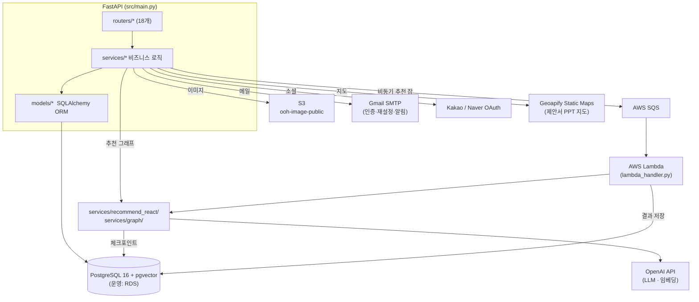

# admix — Backend

FastAPI + LangGraph 기반 OOH 매체 추천 API. 광고주 자연어 발화를 그래프로 분석해 매체 리스트·자연어 설명·맞춤 제안서를 생성하고, 관리자 백오피스용 매체·회원·문의·제안서·FAQ·대시보드 API를 제공한다.

전체 개요·설계도는 루트 [README](../README.md),
운영 배포는 [deploy/](../deploy/README.md),
도메인/DB 메모는 [CONTEXT.md](../CONTEXT.md) 참조.

## 스택

| 영역      | 사용                                                                          |
| --------- | ----------------------------------------------------------------------------- |
| 웹        | FastAPI 0.115 · uvicorn · Pydantic 2 / pydantic-settings                      |
| AI        | LangGraph 0.2 · langchain-openai · openai · pgvector 임베딩(1536)             |
| DB        | PostgreSQL 16 + pgvector · SQLAlchemy 2 · psycopg2 / psycopg3(pool) · Alembic |
| 세션 영속 | langgraph-checkpoint-postgres (그래프 체크포인트)                             |
| 인증      | python-jose(JWT) · passlib · OAuth(카카오/네이버)                             |
| 비동기    | boto3 · AWS SQS + Lambda                                                      |
| 문서생성  | python-pptx(제안서 PPT) · openpyxl(엑셀)                                      |
| 런타임    | Python 3.12 (slim)                                                            |

## 아키텍처



3계층: **routers(HTTP 경계) → services(로직) → models(ORM)**. AI 추천만 별도 그래프 패키지로 분리.

## 디렉터리

```
src/
├── main.py            앱 생성 · CORS · lifespan · include_router(18)
├── config.py          Settings — DB / OpenAI / JWT / OAuth / SMTP / AWS(SQS·S3) / GA4 / Geoapify
├── database.py        SQLAlchemy engine + Base
├── routers/           API 엔드포인트
│   ├── auth.py oauth.py                 이메일 인증 · JWT · 카카오/네이버 소셜 로그인
│   ├── recommend_react.py               추천 챗봇 (현행 · 비동기 잡 + 폴링)
│   ├── recommend_v2.py chat_graph.py    이전 버전 그래프 (보존)
│   ├── media.py members.py              매체 · 회원
│   ├── proposals.py proposals_client.py 제안서 (admin / client)
│   ├── inquiries.py inquiries_client.py 문의 (admin / client)
│   ├── faq.py dashboard.py              FAQ · 대시보드 통계
│   └── admin.py admin_auth.py admin_media.py admin_chat.py   관리자 백오피스
├── services/
│   ├── recommend_react/   현행 추천 파이프라인 (domain · graph · tools · persist)
│   ├── graph/             그래프 공용 — intent_classifier · welcome · tools · llm · settings · checkpoint_cleanup
│   ├── ai_job_service.py  SQS 발행 + ai_recommend_job 상태 관리 (비동기 추천)
│   ├── deck_converter.py ppt_builder.py   제안서 PPT 생성 (템플릿 채우기 + Geoapify 지도)
│   ├── auth_service.py oauth_service.py   인증 · 소셜 계정 연동
│   ├── media_service.py member_service.py proposal_service.py inquiry_service.py
│   ├── faq_service.py dashboard_service.py ga4_service.py chat_limit.py ad_session_service.py admin_service.py
├── models/            ad_session · user · member_profile · admin(+permission·refresh_token) ·
│                      media(+master·plan·image) · proposal(+item·counter_file) · inquiry · faq · ai_recommend_job
├── alembic/           마이그레이션 (현재 039)
├── lambda_handler.py  Lambda 진입점 (비동기 추천 소비)
├── Dockerfile · Dockerfile.lambda
└── requirements.txt · requirements-lambda.txt
```

## AI 채팅 흐름 (recommend_react)

AI 채팅 요청은 **비동기 잡 큐 + 폴링**으로 처리한다 (프런트 `useReactChat`가 사용).

**그래프 파이프라인**: 의도 분류 → 슬롯 추출 → 완전성 점수 → 호환성 검사 → DB 필터 → rerank(임베딩·상권 인구분포) → 자연어 설명. 상태는 langgraph-checkpoint-postgres로 thread별 영속.

**실행 흐름**:

1. `POST /recommend/react/jobs` → 잡 생성(202), `ai_recommend_jobs` 테이블에 `pending` 기록 + SQS 발행
2. Lambda(`lambda_handler.py`, `Dockerfile.lambda`)가 `process_recommend_job`으로 그래프 실행 → 결과를 같은 테이블에 `done/failed` 기록
3. 프런트가 `GET /recommend/react/jobs/{id}`를 폴링해 표시

## 인증

- **일반 사용자**: 이메일 회원가입 + 이메일 인증(SMTP), 또는 카카오/네이버 소셜(`oauth.py` → `oauth_service`, `social_accounts` 매핑). JWT 발급, 프런트는 쿠키 저장.
- **관리자**: 별도 로그인(`admin_auth.py`) + refresh token 로테이션(`admin_refresh_token`) + 권한(`admin_permission`).
- 소셜 redirect_uri는 **단일 고정값**(`config.kakao/naver_redirect_uri`) — 콘솔 등록값과 정확히 일치해야 함.

## DB / 마이그레이션

- 스키마 생성/변경은 **Alembic 일원화**
- pgvector: `media` 계열 description 임베딩(1536) → cosine rerank.

## 로컬 실행

```bash
cp .env.example .env          # OPENAI_API_KEY · DATABASE_URL 등 입력
docker compose up -d postgres # 루트에서
docker exec admix-postgres psql -U postgres -d admix -c "CREATE EXTENSION IF NOT EXISTS vector;"
alembic upgrade head
docker compose up -d          # 전체 (backend 호스트 8001 → 컨테이너 8000)
```

## 환경변수

전체 목록·설명은 [`.env.example`](.env.example) 참조 — DB · OpenAI · JWT · CORS(`FRONTEND_URL`)/이메일(`WEB_BASE_URL`) · 카카오/네이버 OAuth · SMTP · AWS SQS/S3 · Geoapify · GA4. 운영(EC2) `.env`는 rsync 제외라 서버에서 직접 관리.

## 배포

EC2 단일 VM(docker compose 3-file: base + prod + newacct) + nginx + certbot. 비동기 추천은 Lambda 컨테이너 이미지. 상세·재배포 스크립트는 [deploy/](../deploy/README.md).
