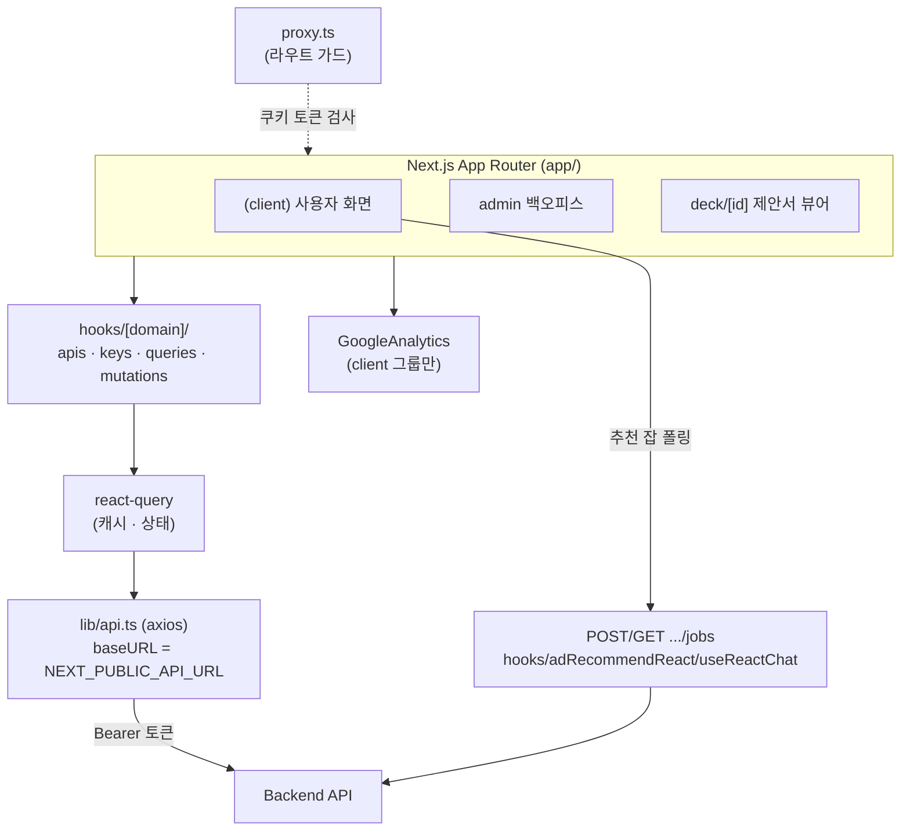

# admix — Frontend

Next.js 16 (App Router) 기반 OOH 매체 추천 플랫폼 프런트.
사용자 화면(추천 챗봇·매체 검색/지도·제안서·마이페이지),
관리자 백오피스, 제안서 뷰어(deck)를 한 앱에서 제공한다.

전체 개요·설계도는 루트 [README](../README.md),
프런트 구조 상세는 [docs/frontend-structure.md](../docs/frontend-structure.md),
디자인 토큰은 [docs/design-tokens.md](../docs/design-tokens.md) 참조.

## 스택

| 영역       | 사용                                                           |
| ---------- | -------------------------------------------------------------- |
| 프레임워크 | Next.js 16.2.4 (App Router) · React 19.2.4                     |
| 스타일     | Tailwind CSS 4 (cosmos 토큰) · tailwind-merge · tw-animate-css |
| UI         | shadcn/ui + `@base-ui/react` · lucide-react · sonner(토스트)   |
| 데이터     | `@tanstack/react-query` 5 · axios                              |
| 폼         | react-hook-form + zod (`@hookform/resolvers`)                  |
| 지도       | 카카오 지도 (`lib/kakaoMap.ts`)                                |
| 분석       | `@next/third-parties`(GoogleAnalytics, GA4)                    |

## 아키텍처



## 라우트 구조 (`app/`)

```
(client)/                         일반 사용자 (proxy.ts 가드 + cosmos 레이아웃)
├── (auth)/                       signup(email·corporate·sns·complete) · find-account
├── (main)/
│   ├── (홈)                      추천 챗봇
│   ├── fixed · moving            고정/유동 매체 검색 + 카카오 지도
│   ├── media/[id]                매체 상세
│   ├── proposals · proposals/[id]  제안서 목록·상세
│   ├── contact · contact/inquiries/[id]  문의
│   ├── service · help · erd      소개 · 도움말 · ERD
├── (mypage)/profile              내 정보
├── oauth/[provider]/callback     카카오/네이버 공용 콜백
└── reset-password                비밀번호 재설정

admin/                            관리자 백오피스
├── (auth)/login
└── (main)/  media · members · proposals(+write) · inquiries · faq · chat · roles · (대시보드)

deck/[id]                         제안서 외부 공유 뷰어 (가드 밖)
```

## 컴포넌트 · 디자인

- `components/`: `common` · `ui`(shadcn + Base UI) · `forms`(RHF+zod) · `layout` · `icons` · `admin` · `proposals`.
- `ui/select`는 Base UI 기반 — `SelectValue` 라벨 표시하려면 root에 `items` prop 필요.

## 인증 / 가드

- `proxy.ts`(Next 16, 구 middleware): 사용자 토큰 쿠키(`USER_TOKEN_COOKIE`)로 `/login·/signup·/find-account`(로그인 시 홈으로) / `/profile`(비로그인 시 홈으로) 리다이렉트. `/signup/sns·/signup/complete`는 예외(SNS 직후 토큰 보유 상태).
- 소셜: `oauth/[provider]/callback`이 code 교환 → 토큰 쿠키 저장 → 이동.

## 환경변수

전체 목록은 [`.env.local.example`](.env.local.example) 참조 — `NEXT_PUBLIC_API_URL`(백엔드) · `NEXT_PUBLIC_KAKAO_MAP_KEY`(지도) · `NEXT_PUBLIC_GA_ID`(GA4). 운영은 Amplify 환경변수로 주입.

## 로컬 실행

```bash
cp .env.local.example .env.local   # NEXT_PUBLIC_API_URL=http://localhost:8001 등
npm install
npm run dev                          # http://localhost:3000
```

## 배포

AWS Amplify(`main` push 자동 빌드/배포) — 운영 `https://www.admixai.co.kr`.
